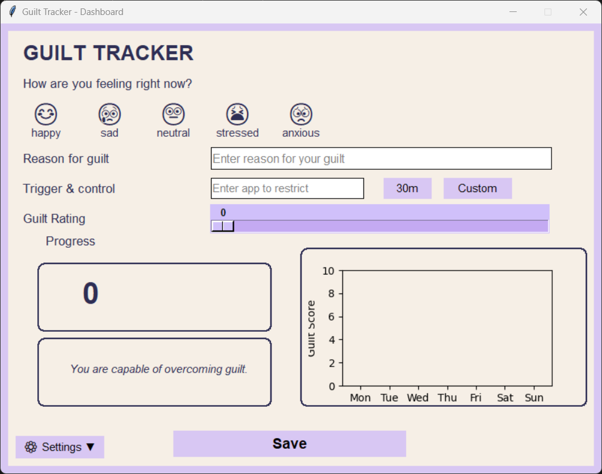
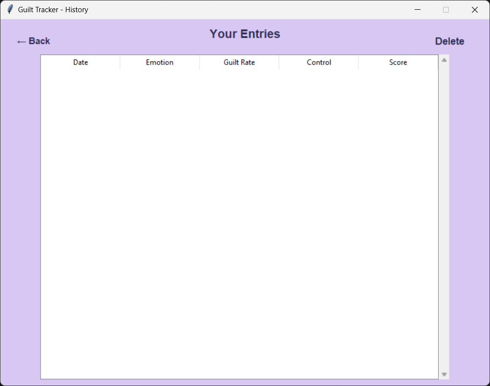

# 💭 Digital Guilt Tracker

> *"Track your feelings. Understand your guilt. Grow emotionally."*

[](LICENSE)
[](https://github.com/VatsCoder/Digital-Guilt-Tracker/issues)
[](https://github.com/VatsCoder/Digital-Guilt-Tracker/pulls)
[](https://github.com/VatsCoder/digital-guilt-tracker/stargazers)

---

## 🧠 About the Project

**Digital Guilt Tracker** is a Python-based desktop application designed to help users log their feelings of guilt, rate emotional states, and monitor patterns over time. With a simple yet interactive UI, users can develop self-awareness and mental clarity.

---

## 🖼️ Screenshots

| Dashboard | History View |
|----------|---------------|
|  |  |

> 📸 *More screenshots available in the [`/screens`](./screens/) folder.*

---

## ✨ Features

- 👤 **User Authentication** — Signup & Login system.
- 📝 **Daily Emotion Logging** — Rate guilt level, emotions & reasons.
- 📊 **Guilt Score Calculation** — Based on emotion + guilt rating.
- 📈 **Weekly Progress Chart** — Visualize trends via Matplotlib.
- 📚 **History Viewer** — Scrollable table of past entries with delete option.
- 🎨 **Custom UI** — Built using Tkinter for an intuitive layout.

---

## 🛠 Tech Stack

| Layer     | Technology      |
|-----------|-----------------|
| Frontend  | Tkinter (Python GUI) |
| Backend   | SQLite3 (local DB), Custom Python logic |
| Charts    | Matplotlib |
| Language  | Python 3.x |

---

## 🚀 Getting Started

### 🐍 Prerequisites

- Python 3.8+
- pip installed

### 🔧 Installation

```bash
git clone https://github.com/yourusername/digital-guilt-tracker.git
cd digital-guilt-tracker
pip install matplotlib
```

### ▶️ Run the App
```bash
python begin.py
```

### 🗂️ Project Structure
├── backend.py         # Handles DB + logic \
├── dashboard.py       # Dashboard GUI \
├── login.py           # Login / Signup \
├── history.py         # History viewer \
├── profile_details.py # Profile page \
├── begin.py            # App launcher \
├── screens/           # UI screenshots \
└── README.md

### 🧪 Test It Yourself
1. Launch the app via begin.py.
2. Sign up with a new username & password.
3. Start logging your guilt and emotions daily.
4. View weekly trends and history.
5. Reflect. Improve. Grow.

### 🤝 Contributing
Contributions, bug reports and feature suggestions are welcome!

1.🍴 Fork the repo \
2.🌱 Create your branch git checkout -b feature-name \
3.💾 Commit your changes \
4.📩 Submit a pull request 

Make sure to check open issues before creating duplicates.

### 📄 License

This project is licensed under the MIT License

> *"⭐ If you find this project helpful, consider starring it and sharing it with others!"*
